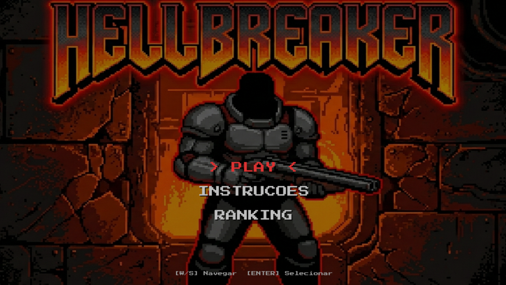

# Project Hellbreaker

FPS pseudo-3D estilo DOOM desenvolvido com Python e Pygame, utilizando raycasting para renderizar um ambiente 3D a partir de um mapa 2D baseado em tiles.



---

## Funcionalidades

- Renderizacao pseudo-3D via raycasting com paredes texturizadas
- 3 tipos de inimigos com IA e pathfinding (BFS)
- 10 rounds com dificuldade progressiva
- 3 vidas por partida com kills acumulativos
- Power-up de dano ao matar demonios
- Ranking local persistente
- Efeitos sonoros e musica

---

## Requisitos

- Python 3.8+
- Pygame

---

## Instalacao

### Linux / macOS

```bash
python3 -m venv venv
source venv/bin/activate
pip install -r requirements.txt
python3 main.py
```

### Windows

```bash
python -m venv venv
venv\Scripts\activate
pip install -r requirements.txt
python main.py
```

---

## Controles

| Input | Acao |
|---|---|
| W / A / S / D | Movimentacao |
| Mouse | Olhar ao redor |
| Botao esquerdo | Atirar |
| ESC | Menu / Sair |

---

## Estrutura

```
main.py              Loop principal e estados do jogo
settings.py          Resolucao, FOV e configuracoes
map.py               Mapa e tiles acessiveis
player.py            Jogador, movimentacao e vida
raycasting.py        Algoritmo de raycasting
object_renderer.py   Renderizacao e HUD
sprite_object.py     Sprites e pickups
object_handler.py    Spawn de NPCs e objetos
npc.py               Inimigos e IA
pathfinding.py       Pathfinding BFS
weapon.py            Arma e sistema de boost
sound.py             Sons e musica
score.py             Pontuacao, rounds e ranking
resources/           Texturas, sprites, sons e fontes
```

